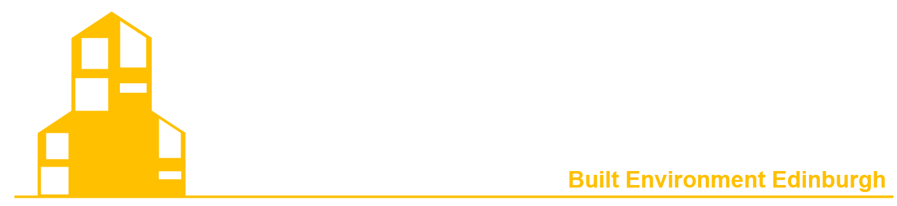

Welcome to `Built Environment Edinburgh` community page!

It is a student-led group at the University of Edinburgh focused on research and knowledge exchange in *sustainable and resilient built environments*, where both internal and external participation is welcomed. Main activities include *monthly events*, such as:
  - Project presentations
  - Research-sharing sessions
  - Skill-development workshops (e.g., academic writing and related training)

Use this site to explore our people, projects, and publications!

{: width="75%"}

**Key updates**
- 2025-11-27: Two members introduced their research in November group meeting!

**Next activity**
- TBC: Solstice meeting in December meeting

**Key information**
Participants:

**Collaboration Map**

Note: We have sessions that welcome audience from external bodies (research institues), with presentation and discussion welcomed!