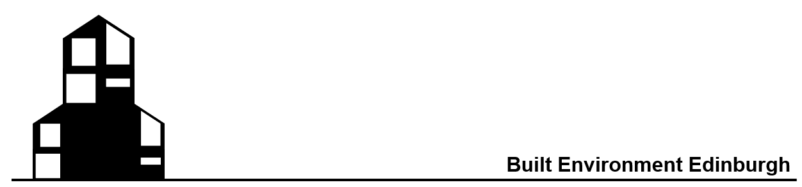

**Welcome to `Built Environment Edinburgh` community page!**

It is a PhD student-led group at the [University of Edinburgh](https://www.ed.ac.uk/) focused on research and knowledge exchange in *sustainable and resilient built environments*, where both internal and external participation is welcomed. 

  <h2 style="margin-top: 0; color: #2c3e50;">
    🏛️ Welcome to <code style="background: #e8f4f8; padding: 0.2em 0.4em; border-radius: 4px;">Built Environment Edinburgh</code> community page!
  </h2>
  
  

    <strong>📊 Our journey so far:</strong> 
    ✅ <strong>6 meetings</strong> co-created 
    🎓 <strong>4 PhD work presentations</strong> 
    🔧 <strong>Workshops</strong> coming soon!
  

  
  

    

      <strong>⏰ Next Meeting Countdown:</strong> 
      
        Loading...
       
      <small id="next-meeting-date" style="color: #7f8c8d;">
        (We meet every last Friday of the month at 13:00 UK time)
      </small>
    

  

  
  

    <strong>📍 Location:</strong> Online / University of Edinburgh 
    <strong>👥 Join us:</strong> Everyone interested in built environment research is welcome!
  

**Future activities**
- 2026-02-27: 
- Recurring Meetings in on last Friday of each month (at Murchison House G.04 for on-site audience)

**Previous meetings**
- 2025-06-02: First meeting!
- 2025-10-17: New semester meeting!
- 2025-11-27: Two members introduced their research in November group meeting!
    - Discussed future directions of the group, suggesting a page for showcasing each other's interest;
    - Presentation from Androniki and Rui.
- 2026-01-30: A follow-up presentation from Rui.

*Geographic Distribution of Audience*


**Main Contacts**

Everyone is very welcome to join any knowledge-sharing session. Please [email](mailto:rui.bo@ed.ac.uk) for sign up.
